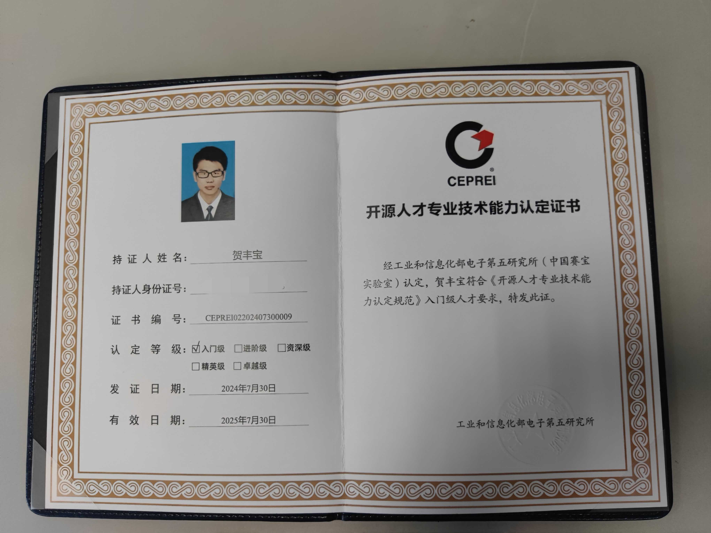

> 如果你感觉自己被困住了，焦虑并充满消极情绪，生命出现了停滞，那么治疗方法很简单：做点什么。
> ——[《摆脱束缚的最好方法》](https://www.ggnotes.com/the-best-way-to-get-unstuck/)

## 👋 Hi

我是贺丰宝 @hefengbao

## 👨‍💻 编程

工作主要使用 PHP(Laravel) 做一些简单的项目;

断断续续学习了 Android(Kotlin)，自己做项目“玩” 。

学艺不精😔，不追求技法，尝试去把自己的想法变成产品，有人愿意用的产品。

## 📫 联系

主页：[https://hefengbao.github.io](https://hefengbao.github.io)

Foxmail：hefengbao

## 🐛 项目

开发几款以中药材名命名的应用，且看能不能开出一剂有效的“药方”。

- [京墨](https://github.com/hefengbao/jingmo)
- [玉竹](https://github.com/hefengbao/yuzhu)

## 👀 参与开源项目

工作中的项目基本要按别人的要求来，而开源项目则可以把自己的想法变成产品。

<!---
hefengbao/hefengbao is a ✨ special ✨ repository because its `README.md` (this file) appears on your GitHub profile.
You can click the Preview link to take a look at your changes.
--->
